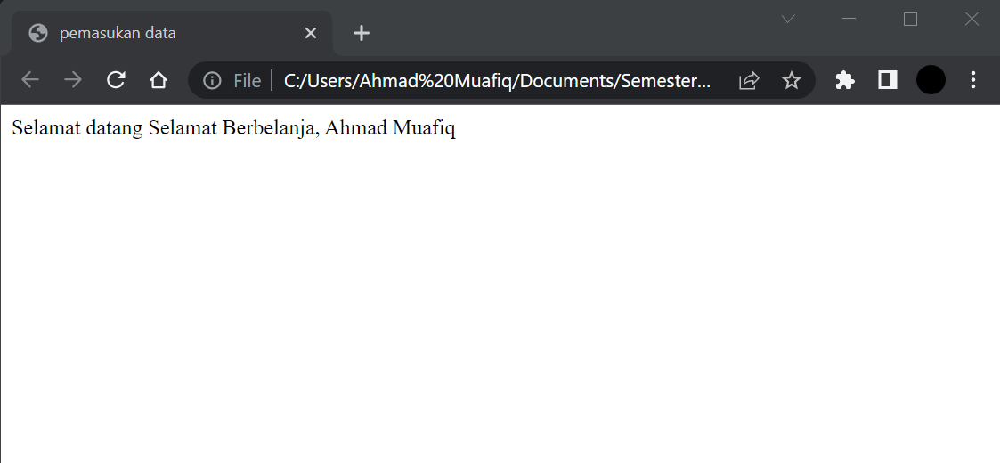

# Lab5Web
## Tugas Pemograman Web - pertemuan 6 Praktikum 5

<table border="1" cellpadding="6" cellspacing="2">
            <thead>
            <tr>
            <th>Nama </th>
            <th>Ahmad Muafiq</th>
            </tr>
            </thead>
            <tbody>
            <tr>
            <td>NIM </td>
            <td >312010152</td>
            </tr>
            <tr>
            <td>Kelas </td>
            <td>TI.20.B1</td>
            </tbody>
            </table>

1. Pengenalan Javascript.

<i> Gambar di bawah ini merupakan tampilan awal pengenalan Javascript.

2. Javascript Dasar.

<i> Pemakaian alert sebagai properti window. Berikut tampilanya.

3. Javascript Dasar.

<i> Pemakaian method dalam objek. Berikut untuk tampilannya.

4. Javascript Dasar.

<i> Pemakaian prompt untuk menampilkan pop up dan memasukan data. Berikut untuk tampilannya.

 

5. Javascript Dasar.

<i> Pembuatan fungsi dan cara pemanggilannya. Berikut tampilanya.

